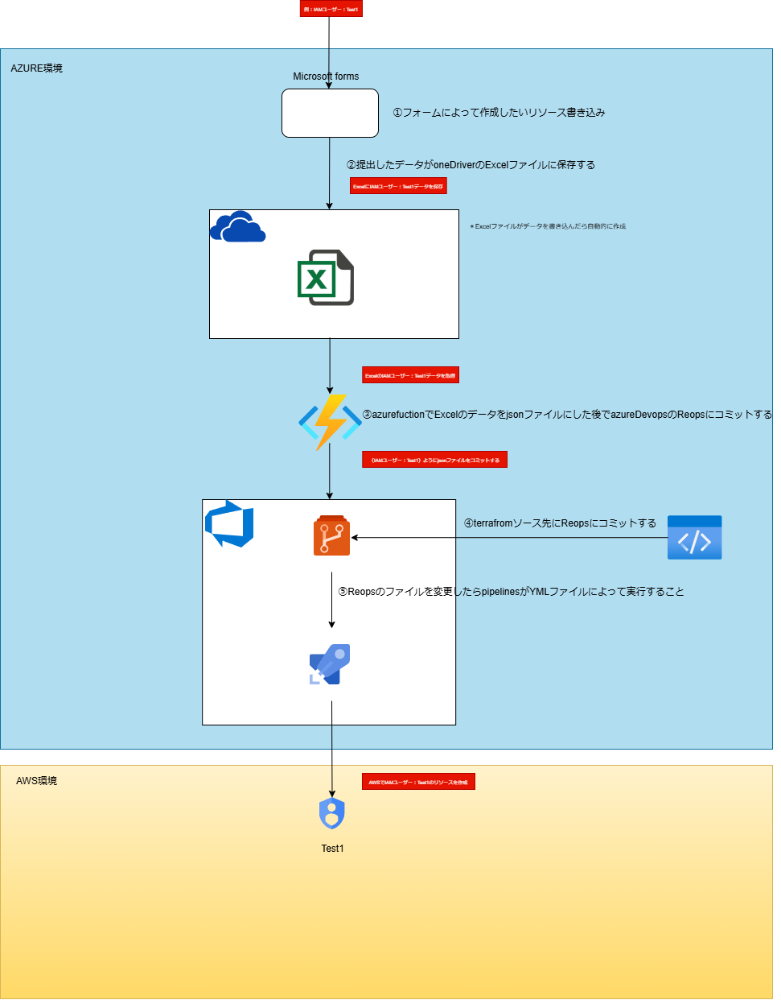
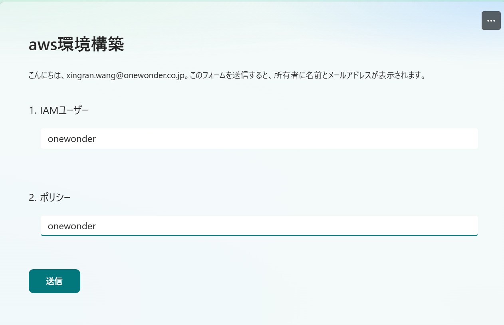
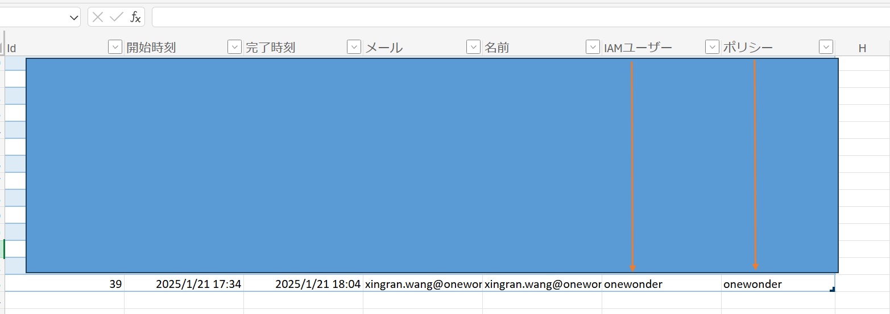
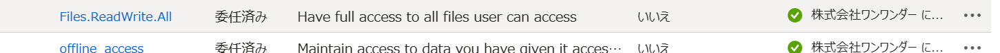
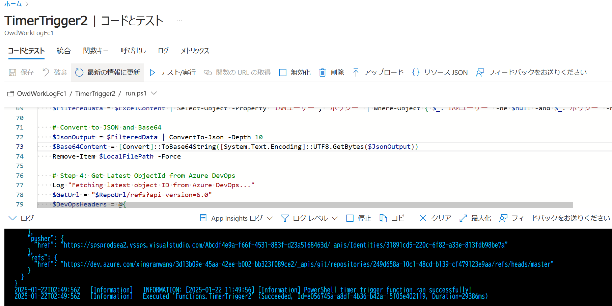
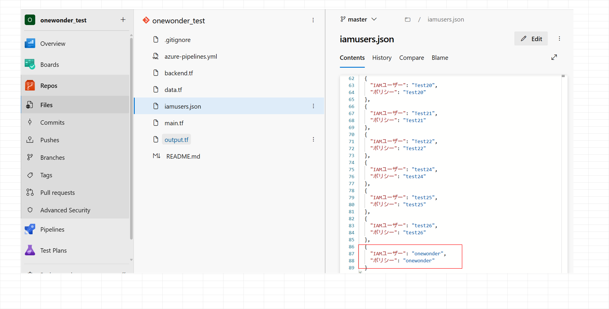
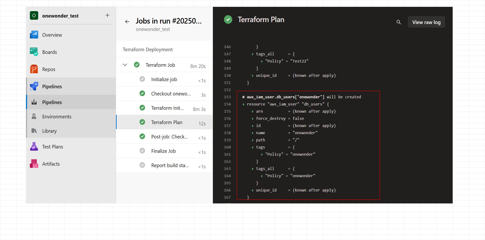

- [OneWonder](https://next.onewonder.co.jp/) はクラウドコンピューティングに特化したサービスを提供しています
## 使用技術一覧


## プロジェクト名
Form2CloudBuilder1.0
## プロジェクト概要
Microsoft Formのフォームで既定のリソース欄にリソース名を入力すると、AWSまたはAzureのリソースを作成できるシステムです。
## 流れイメージ

<div style="border:1px solid black; padding:10px; display:inline-block; margin-bottom:5px;">
Microsoft Form
</div></br>
↓</br>
<div style="border:1px solid black; padding:10px; display:inline-block; margin-bottom:5px;">
OneDrive
</div></br>
↓</br>
<div style="border:1px solid black; padding:10px; display:inline-block; margin-bottom:5px;">
azureFunction
</div></br>
↓</br>
<div style="border:1px solid black; padding:10px; display:inline-block; margin-bottom:5px;">
azureDevOps
</div></br>
↓</br>
<div style="border:1px solid black; padding:10px; display:inline-block; margin-bottom:5px;">
AWSリソース
</div></br>

## システムアーキテクチャ図
- [azureDevops.drawio](docs)


## 構築流れ
#### ①Microsoft Formを作成


例：</br>
IAMユーザー:onewonder</br>
ポリシー:onewonder</br>
</br>
入力したら「送信」をクリックする

#### ②データがOneDriveのExcelファイルに保存


（＊OneDriveのExcelファイルが自動的に作成）</br>
下向き矢印にデータをExcelファイルに保存しました。

#### ③azureFunctionロジック


↑
APIアクセス許可

###### azureFunctionロジックイメージ

<div style="border:3px solid black; padding:10px; display:inline-block; margin-bottom:5px;">
IAMユーザー列とポリシー例のデータを取得
</div></br>
↓</br>
<div style="border:1px solid black; padding:10px; display:inline-block; margin-bottom:5px;">
取得したデータをjsonファイルにする
</div></br>
↓</br>
<div style="border:1px solid black; padding:10px; display:inline-block; margin-bottom:5px;">
作成したjsonファイルをazureDevopsのReopsのjsonファイル(今回iamusers.json)を上書き
</div>
</br>
</br>


↑実行成功</br></br>

- [azureFunctionロジック](azurefunction)
</br>


■注意事項：</br>
*Refreshtokenを先に取得</br>

*requirements.psd1に下記レイヤーをコピペする</br>
```
# This file enables modules to be automatically managed by the Functions service.
# See https://aka.ms/functionsmanageddependency for additional information.
#
@{
    # For latest supported version, go to 'https://www.powershellgallery.com/packages/Az'.
    'Az' = '12.*'
    # Uncomment below to use Az module 11.* instead
    # 'Az' = '11.*'
    'Microsoft.Graph.Users' = '2.*'
    'Microsoft.Graph.Authentication' = '2.*'

    # Add ImportExcel module
    'ImportExcel' = '7.*' # Specify the version you want, adjust as necessary
}
```


#### ④azureDevopsの設定

この部分が二つ分けて説明します。</br>
reopsの設定：</br>
- [Reopsフォルダ](Repos)のファイルを全部Reposにコミットする

↑
コミットした後でazureFunctionを実行したら赤ボックスの中にデータをコミット成功

pipelinesの設定：</br>
- [pipelinesフォルダ](pipelines)のファイルをpipelinesにコピペする

↑
リソース作成完了でした。

#### 連絡先
蔡：inje.sai@onewonder.co.jp</br>

王：xingran.wang@onewonder.co.jp